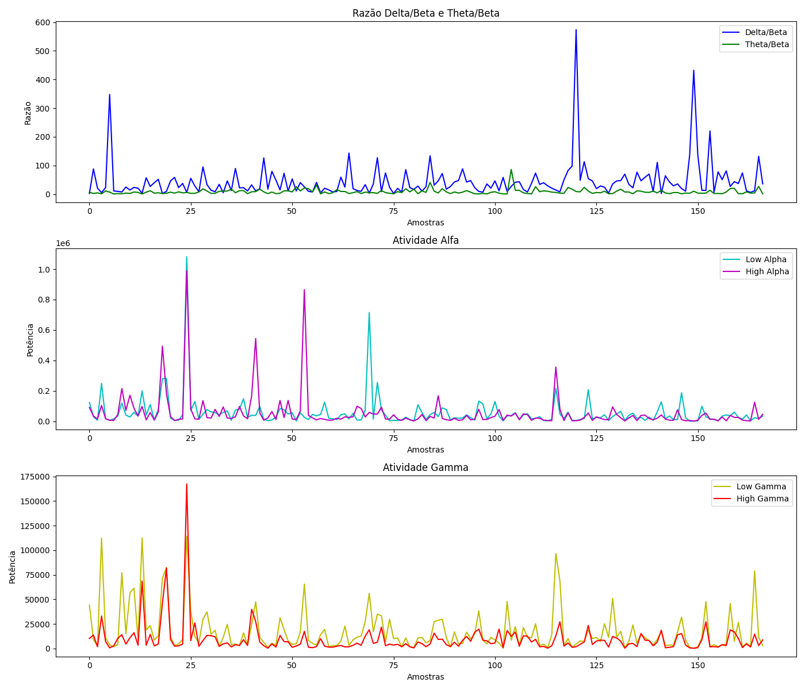
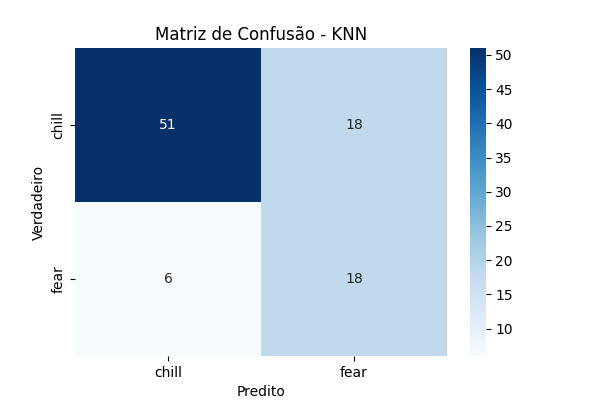
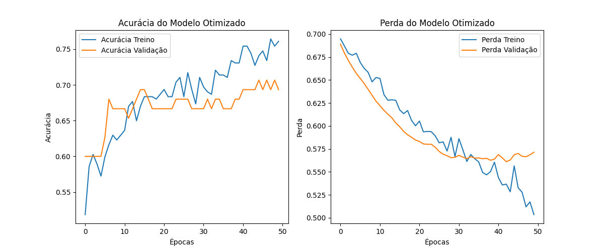
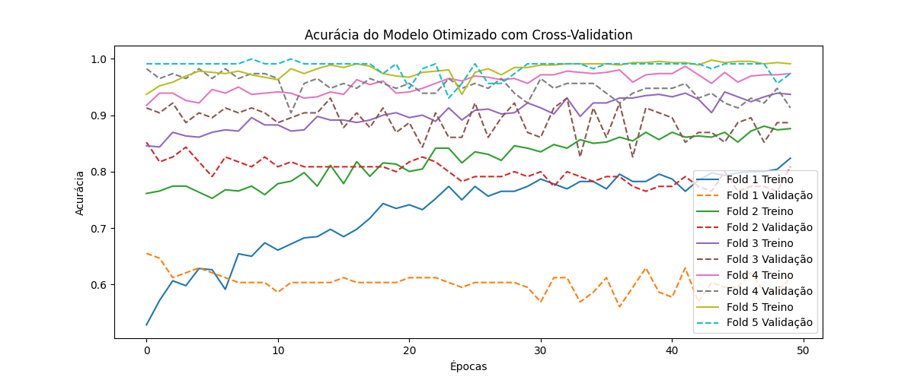
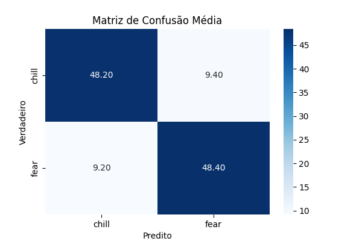

# EEG-VRET: Virtual Reality Exposure Therapy with Real-Time AI Fear Detection

## Overview

This project is a Thalassophobia **Virtual Reality Exposure Therapy (VRET)** application using the **NeuroSky Mindwave** EEG device to fetch mindwaves and control the environment with **real-time fear detection based on a Neural Network**. The system analyzes the user's brainwaves in real time and detects moments of fear through a **Convolutional Neural Network (CNN)** — so if the AI predicts that the player is uncomfortable, the scenery changes to reduce exposure to the stimuli.

---

## Data Collection and Preprocessing

The datasets used to train the fear detection model were collected during multiple sessions with the **NeuroSky Mindwave**. The sessions included periods where the participant was exposed to fear-inducing stimuli, followed by relaxation phases.

Below is the EEG data visualization from one of these sessions. The first half of the graph shows brainwave activity during relaxation, while the second half represents fear:

These datasets, included in the repository, were processed, normalized, and used for model training.

---

## Model Training and Results

Initially, a **K-Nearest Neighbors (KNN)** model was implemented for fear detection. However, the results were unsatisfactory due to its lower accuracy in detecting fear, although it performed well in detecting relaxing signals, as seen in the confusion matrix below:

To improve performance, I decided to change the model and use a **Convolutional Neural Network (CNN)**. Below are the training and validation performance plots of the CNN model:

Further optimization was achieved by implementing **cross-validation** and **hyperparameter tuning** to maximize accuracy. The results of the optimized model are shown below:

- **Accuracy Over Folds**:

- **Confusion Matrix**:

---

### Integration with Unity and NeuroSky Mindwave

The project seamlessly integrates the **NeuroSky Mindwave** EEG device into the **Unity** engine by utilizing the **ThinkGear Connector** software provided by NeuroSky. This software streams EEG data through a **TCP connection** on `127.0.0.1:13854`, making it accessible within the Unity environment. For more details on the ThinkGear Connector, visit the official documentation: [ThinkGear Connector Development Guide](https://developer.neurosky.com/docs/doku.php?id=thinkgear_connector_development_guide).

The data is fetched and processed in real time using a buffers implemented within the `MindwaveController` script. This script establishes a TCP connection to the ThinkGear Connector, listens for incoming data packets, and parses the JSON-formatted responses.

This real-time integration enables the application to dynamically monitor the user's brainwave activity. The processed data is passed to the AI system, which utilizes it to make decisions, such as transitioning to a calmer scene when the user is in a state of fear.

## Conclusion

This project successfully uses **NeuroSky Mindwave** EEG data to **detect fear using a Neural Network** for a VR exposure therapy application. By leveraging real-time brainwave analysis, the system enhances safety and personalization in exposure therapy, creating a new standard for fear-based treatment methods.
